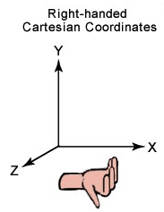
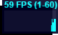

## THREE.js入门到放弃
### Three.js是一个3D JavaScript库
Threejs封装了底层的图形接口，使得程序员能够在无需掌握繁冗的图形学知识的情况下，也能用简单的代码实现三维场景的渲染。Three.js能大大简化WebGL的开发

Threejs用得是右手坐标轴



### Three.js的三要素： 场景(scene)、渲染器(render)、相机(camera)
#### 场景(scene)： 
```text
    var scene = new THREE.scene();
```
#### 相机(camera)
定义了三维空间到二维屏幕的投影方式，用“照相机”这样一个类比，可以使我们直观地理解这一投影方式。
##### 正交相机
```text
var camera = new THREE.OrthographicCamera(left, right, top, bottom, near, far);//正交投影
camera.position.set(x, y, z) //相机放哪
camera.lookAt({
    x: num,
    y: num,
    z: num
}) //往哪看
```


* left: 左平面距离相机中心点的垂直距离；
* right: 右平面距离相机中心点的垂直距离；
* top: 顶凭卖弄距离相机中心点的垂直距离；
* bottom: 底平面距离相机中心点的垂直距离；
* near: 近平面距离相机中心点的垂直距离；
* far: 远平面距离相机中心点的垂直距离。


 
##### 透视相机
```text
var camera = new THREE.PerspectiveCamera(fov, aspect, near, far);//透视投影
camera.position.set(x, y, z) //相机放哪
camera.lookAt({
    x: num,
    y: num,
    z: num
}) //往哪看
```


* fov: 视角；
* aspect: 实际窗口的纵横比；
* near: 距离近平面的距离
* far: 远处的截面


###### 
#### 渲染器(render)
```text
 var renderer = new THREE.renderer();
 renderer.(scene, carmer); //在页面上渲染场景和，相机；
 renderer.setSize(w, h); //设置渲染器大小；
 renderer.setClearColor(0x000000, 1.0); //设置渲染器的颜色，透明度；
 renderer.domElement(); //渲染器元素；
 renderer,clear(); //清除渲染；
```
### 其他
#### 光源
##### 环境光(AmbientLight): 这种光全局照亮场景的所有对象；
经过多次反射而来的称为环境光(不能用来投射阴影)
```text
var light = new THREE.AmbientLight(color, intensity);
light.position.set(x, y, z); //光源放哪
scene.add(light); //向场景中添加光源
```
* color: 颜色
* intensity: 强度
##### 平行光(DirectionalLight): 往特定方向发射的光
```text
var directionalLight = new THREE.DirectionalLight( color, intensity );
light.position.set(x, y, z);
scene.add(light);
```
##### 点光源(PointLight): 单个点向所有方向发射光；
```text
var light = new THREE.PointLight(color, intensity, distance, decay); 
light.position.set(x, y, z); //光源放哪
scene.add(light); 
```
* distance: 距离，当距离为此的时候，光线衰减为零
* decay: 衰减
##### 聚光灯(SpotLight): 这种光从沿着一个方向的单个点发射，沿着锥体，其尺寸越来越远。
```text
var spotLight = new THREE.SpotLight(color, intensity, distance, angle, penumbra, decay);
light.position.set(x, y, z);
scene.add(light);
```
* angle: 角度，不应该超过Math.PI/2
* penumbra: 因为半影而产生的衰减

（*光源之间可以相互组合完成效果*）
#### 几何体+材质:
Three.js封装了一部分比较常规的几何体（Three.js没有定义的形状可以自定义）

例：立方体
```text
var geometry = BoxBufferGeometry(width, height, depth, widthSegments, heightSegments, depthSegments)
var material = new THREE.MeshBasicMaterial({
                   color: 0xff0000,  //定义物体的颜色 
               }) //定义物体的材质
testMesh = new THREE.Mesh(geometry, material);
scene.add(testMesh); /向场景中添加物体
```
* widht: 对应x轴的宽度；
* height: 对应y轴的宽度；
* depth: 对应z轴的宽度；
* widthSegments/heightSegments/depthSegments: 沿侧面高度的分割面的数量；
#### 画点、线
```text
var p1 = new THREE.Vector3( x, y, z );
var p2 = new THREE.Vector3( x, y, z );
var geometry = new THREE.Geometry();
geometry.vertices.push(p1);
geometry.vertices.push(p2);
var material = new THREE.LineBasicMaterial();
var line = new THREE.Line( geometry, material, THREE.LinePieces );
```
##### Vertor3: 表示3d矢量的类
* 3d空间中的一点
* 3d空间中的方向和长度
* 任意排序的三元数字
##### Gemoetry(): 所有集合模型的基础类
#### 动画：动画的实现也是通过在每秒中多次重绘画面
当产生运动时用可以用下面两种方式进行重绘（衡量画面切换速度，每秒帧数FPS（Frames Per Second），是指每秒画面重绘的次数）
```text
setInterval()  //优点能够手动调整FPS，
requestAnimationFrame() //固定FP为60
```
当浏览器达不到设定的调用周期时，requestAnimationFrame采用跳过某些帧的方式来表现动画，虽然会有卡滞的效果但是整体速度不会拖慢，而 setInterval会因此使整个程序放慢运行，但是每一帧都会绘制出来；

### 性能检测(Stat.js)
```text
var stat;
function initStat(){
    stat = new Stats();
    stat.domElement.style.position = 'absolute';
    stat.domElement.style.right = '0px'; 
    stat.domElement.style.top = '0px';
    document.body.appendChild(stat.domElement);
}
function animation(){
    stat.begin();
    //动画
    stat.end();
}
```
在动画前调用stat.begin(),动画结束后调用stat.end();
